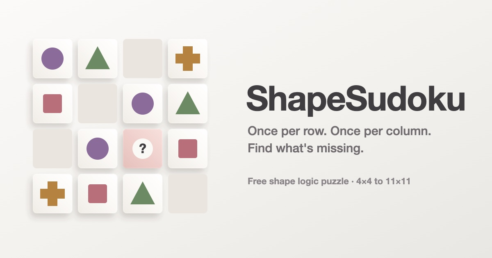

# ShapeSudoku

**Once per row. Once per column. Find what's missing.**

ShapeSudoku is a free shape logic puzzle for sharpening deductive reasoning.
Every shape appears exactly once in each row and each column; one square is
marked `?`, and you work out which shape belongs there.

▶ **Play:** https://pulsarsandpulsar-stack.github.io/shapesudoku/



## Features

- Adaptive difficulty that follows your score, from easy 4×4 grids to expert 5×5
- Advanced progression up to 11×11, unlocking one new shape at each larger grid
- Manual mode for any grid from 2×2 to 11×11 and any level
- Pencil notes in empty squares, with clashes flagged
- Step-by-step explanation of the deduction after every puzzle
- Per-puzzle and total practice timers, streaks and score
- Light and dark themes; works on phones, tablets and computers; no sign-up

No build step, no dependencies: plain HTML, CSS and JavaScript.

## Running locally

Open `index.html` in a browser, or serve the folder with any static server:

```
python3 -m http.server 8000
```

then visit `http://localhost:8000`.

## How it works

- `js/engine.js`: shapes, a random Latin-square generator, and a solver
  that uses the two deductions people make (a square with only one shape
  left, and a shape with only one place left in its row or column). The
  solver checks every puzzle is solvable by logic alone and produces the
  step-by-step explanation.
- `js/difficulty.js`: measured presets for every grid size and level, and
  the adaptive progression that maps a running score to a grid and level.
- `js/app.js`: rendering, answers, notes, timers, settings, and progress
  saved in `localStorage`.
- `fonts/`: self-hosted Bricolage Grotesque (SIL Open Font License, see
  `fonts/OFL.txt`).

